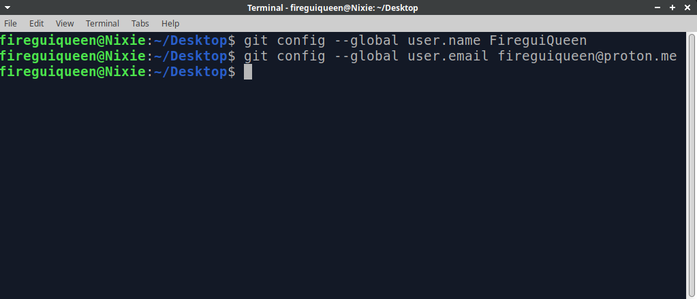
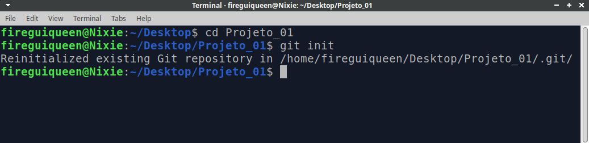
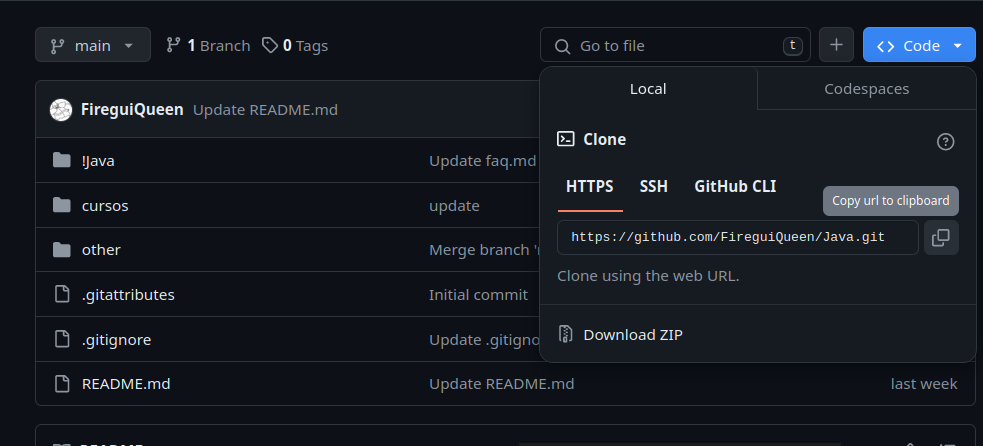
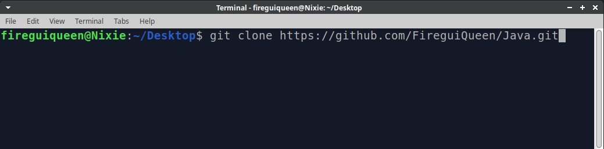

# Repositório 
Conforme definido pelo "Oxford Languages", **"repositório"** é:
- Um local para guardar, arquivar ou colecionar algo.

Em essência, um repositório de software, ou simplesmente repositório, é o local onde **todos os arquivos da nossa aplicação serão armazenados**.

Cada repositório pode ter uma estrutura diferente, podendo ser completamente organizado ou desorganizado.


### Em um repositório organizado de um website, podemos observar: 
```md
.project
├── index.html
└── src
    ├── app
    │   ├── index.css
    │   └── main.js
    │
    └── assets
        ├── background
        │   └── background.png
        ├── fonts
        │   └── JAPANESE_2020.otf
        └── icons
            └── poker-chip.png
```
> Cada parte do site foi separada em diferentes diretórios (pastas). As fontes estão em `fonts`, os ícones estão em `icons`..

### Em um repositório desorganizado de um website, podemos observar:
```md
.project
    ├── index.html
    ├── index.css
    ├── main.js
    ├── background.png
    ├── JAPANESE_2020.otf
    ├── poker-chip.png
```
> Todos os arquivos do website estão em um único nível de documento, todos no mesmo diretório (pasta), o que resulta em um repositório completamente desorganizado.

____________________

## Criando um repositório git 
Para transformar seu repositório local, ou seja, aquele que está em sua máquina, em um repositório Git local, basta acessá-lo pelo seu terminal e digitar `git init`. Em português, isso seria algo como `git inicializar`.


Antes de fazermos isso, precisamos informar ao Git quem somos, ou seja, quem está trabalhando neste 
repositório. Para isso, seguiremos estes passos em nosso terminal:
- `git config --global user.name [seu nome aqui]`
- `git config --global user.email [seu email aqui]`

Entender essas linhas é bem simples:
1. `git` - significa que os comandos desta linha são do Git. Precisamos executar a ferramenta.
2. `config` - aqui acessamos a configuração da ferramenta Git.
3. `--global` - aqui definimos que o nome/email colocados serão utilizados para todos os repositórios Git.
4. `user.name / user.email` - aqui utilizamos para definir nosso nome e email.
5. `[....]` - seu nome e email serão colocados aqui. 



Então, finalmente podemos criar nosso repositório Git.




## Clonando um repositório 
Existem formas e formas de se clonar um repositório, mas, umas das principais, utilizando o Github, é
pegar a URL do reposítorio, ir no terminal e digitar `git clone [url]`.





